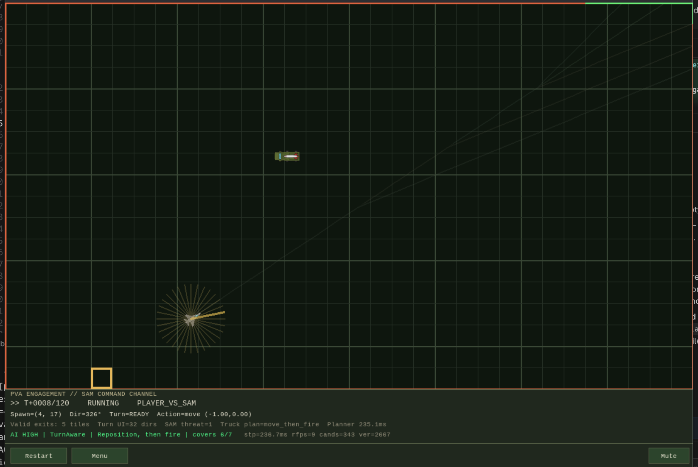
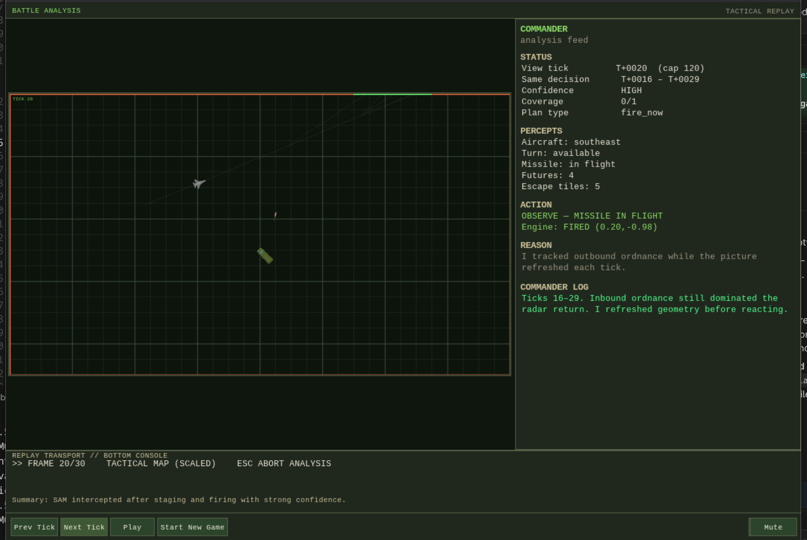
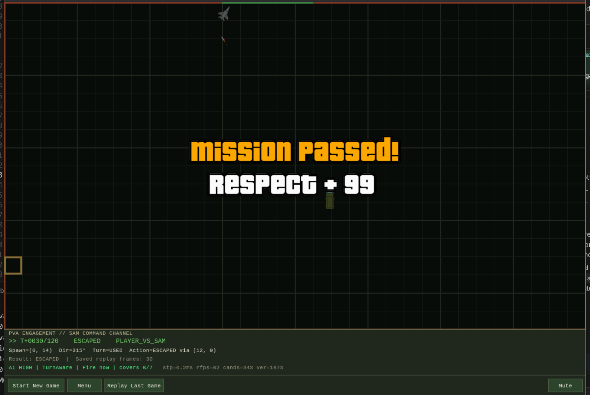
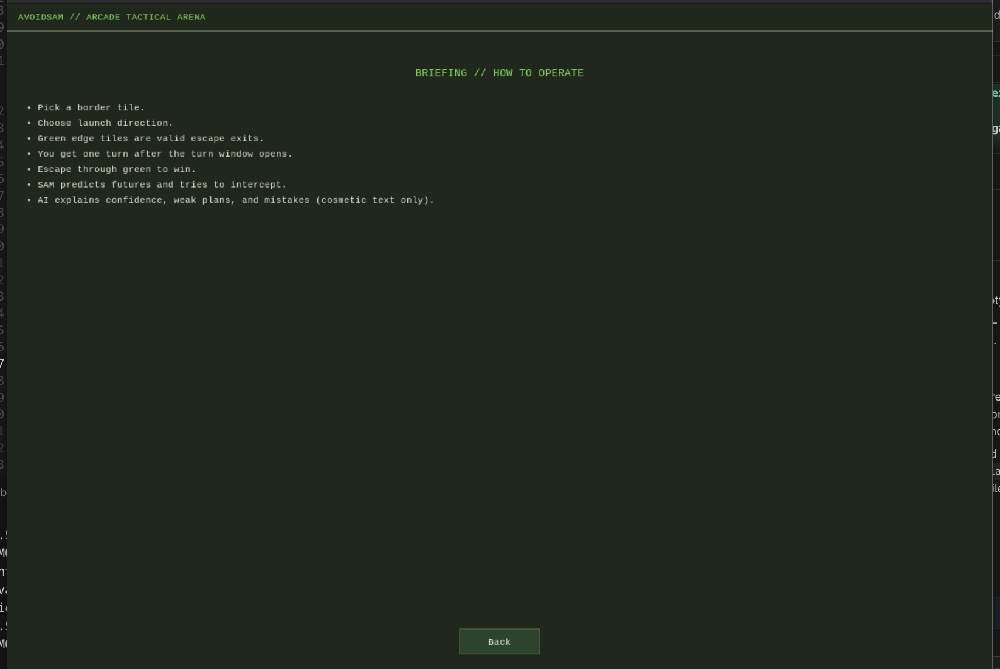

# AvoidSAM — Explainable Player vs Agent Missile Avoidance Game

**AvoidSAM** is a Python **Pygame** tactics game framed as **player versus SAM**: you pilot an aircraft bound for escape while a surface-to-air missile battery tries to close the intercept. It is built as a **final-project–friendly** demonstration of **explainable AI under uncertainty**—prediction, branching futures, graded confidence—not a mythical “perfect” opponent.

The SAM **observes**, **predicts multiple futures**, and **commits to moves** (stage, wait, launch, hold) while surfacing **what it perceived**, **what it did**, and **why**. After each round, **tactical replay** walks the battle tick-by-tick so you can second-guess the agent with full context.

---

## Screenshots

### Main Gameplay



### Tactical Replay / Agent Explanation



### Result Screen



### How To Play



---

## Features

- **Player vs agent** — human aircraft vs autonomous SAM planner.
- **One-turn aircraft escape mechanic** — a single deliberate heading change when the turn window opens.
- **SAM movement / wait / fire planner** — the battery repositions or pauses rather than firing blindly.
- **Turn-aware prediction** — futures branch from plausible pilot options, not only a single assumed path.
- **Future path visualization** — ghost bundles show diverging predictions on the grid.
- **Confidence / coverage display** — the agent reports how strongly predictions align with contemplated actions (cosmetic/analysis layer tied to snapshots).
- **Commander-style replay explanation** — grouped “commander log” narration plus compact **PERCEPTS**, **ACTION**, and **REASON** strips in analyze mode.
- **Sounds and visual sprites** — launch/idle/result audio and aircraft, truck, missile, and overlay art (`assets/`).
- **Mute control** — global mute button in-game.
- **Win / loss result screen** — clear round outcome with thematic presentation.

---

## How the AI works

In plain language, each tick the SAM agent roughly:

1. **Observes** the aircraft’s position and heading (and related state captured for replay).
2. **Predicts several possible futures**—short horizons of where the aircraft might go under the ruleset.
3. **Evaluates candidate SAM actions** (e.g., move launcher, wait, fire, refuse a bad shot).
4. **Chooses** among **move / wait / fire / hold** consistent with validated or explicitly weak posture.
5. **Logs qualitative confidence and numeric coverage-style summaries** used in the HUD and replay.
6. **Replay** then restates **percepts** (compact situational bullets), **action** (decision label plus engine-facing step), and **reason** (human-readable rationale tied to policy and risk flags).

**Policy-related labels you may see in logs or explanations** include:

| Label | Role (high level) |
|--------|-------------------|
| **VERIFIED_PLAN** | Following a stance that validated reasonably against futures. |
| **WEAK_STAGING** | No clean intercept yet; reposition or stage without overcommitting. |
| **WEAK_FIRE_HELD** | Shot rejected because futures coverage / posture was too thin to justify fire. |
| **NO_PLAN_HOLD** | No verified intercept line; hold rather than pretending certainty. |
| **HEAVY_REUSE** | Performance/budget-conscious reuse of a planner step after an expensive cycle. |
| **RISKY_UNVALIDATED** | Plan or step plausible but **not fully validated**—explicit uncertainty flag paired with narratives in replay. |

The agent is deliberately **not** framed as omniscient: weak and risky regimes are **first-class**.

---

## Why the agent is “explainable”

- **Not a black box** — decisions tie back to percept summaries, enumerated actions, and stated reasons surfaced in replay.
- **Says what it perceived** — e.g., heading, turn availability, missile state, corridor shape, predictor bundle counts.
- **Says what it chose** — decision family plus the concrete planner/engine step when relevant.
- **Says why** — reasons map to policies and uncertainty (including weak holds and risky unvalidated stretches).
- **Admits weakness** — low coverage, withheld fire, and validation gaps appear in text and summaries rather than hiding behind generic “because I said so” phrasing where the UI substitutes clearer copy.

The project goal is **interpretable tactical behavior under uncertainty**, not an unbeatable minimax deity.

---

## How to play

1. Pick a **border tile** for launcher placement (**green** edges highlight valid escapes for the pilot).
2. Pick a **launch direction** confirming your shot funnel.
3. **Green border tiles** are **valid exits** for the aircraft; red borders are illegal—exiting there loses the duel on geometry.
4. When the **turn window opens**, the aircraft gets **one turn**—change heading once toward the corridor you want.
5. **Fly out through green** to **win**; the SAM **predicts futures** and tries to **intercept**.
6. After **result**, open **replay** (when available from the round end UI) to **analyze** perceptions, actions, and reasons tick-by-tick.

---

## Controls

| Input | Behavior |
|--------|----------|
| **Mouse click** | Select tiles/directions, confirm choices, activate buttons |
| **Right mouse button** | Contextual cancel / back where the game wires it |
| **Restart / Menu** | Restart round or return to menu from PVA HUD |
| **Replay** | **Prev Tick**, **Next Tick**, **Play** (auto-advance), **Start New Game**, **Menu** |
| **Mute** | Toggle audio |

---

## Installation

### macOS / Linux

```bash
python -m venv venv
source venv/bin/activate
pip install pygame
python main.py
```

### Windows (`cmd` / PowerShell)

```bash
python -m venv venv
venv\Scripts\activate
pip install pygame
python main.py
```

---

## Requirements

- **Python 3.13** — tested against this runtime.
- **pygame 2.6.1** — tested with this pygame line.

Older 3.x versions may work but are **not** the documented test matrix.

### Logging (performance)

By default, `python main.py` runs in **quiet** mode: hot-loop `print` output on **stdout** is discarded (no `logs/run_*.txt` files are created). **stderr** is unchanged so tracebacks still appear in the terminal.

To restore full session logging (tee **stdout** and **stderr** to `logs/run_<timestamp>.txt`):

```bash
# macOS / Linux
AVOIDSAM_VERBOSE_LOGS=1 python main.py
```

```bat
REM Windows (cmd)
set AVOIDSAM_VERBOSE_LOGS=1
python main.py
```

---

## Project structure (brief)

| Path | Purpose |
|------|---------|
| `main.py` | Pygame bootstrap, menus, HUD, drawing, tactical replay chrome, wiring into `App` (quiet vs verbose logging; see **Logging** above) |
| `game/app.py` | Core application state machine, PVA phases, snapshots for replay |
| `game/pva_rules.py` | Grid / border / corridor rules underpinning placement and escapes |
| `systems/launch_system.py` | Launcher / missile-side mechanics layered into simulation |
| `systems/target_predictor.py` | Target motion / futures prediction used by planner-facing logic |
| `assets/pictures/` | Sprites and result overlays |
| `assets/sounds/` | Optional cosmetic audio clips |

---

## Limitations

- The **SAM is not perfect**—it misjudges corridors, misses sparse futures bundles, or stalls on thin coverage like a brittle human operator might.
- The **planner can be expensive** when geometry forces deep re-search or long-shot branching; responsiveness may dip on slower machines (**HEAVY_REUSE** hints at pragmatic shortcuts).
- **Skilled pilots** learn exit patterns and timing faster than newcomers; exploits are plausible because the mandate is **clarity**, not airtight optimality under every human stratagem.
- The **north star is explainable tactical AI**, not a **solved, perfect adversary**.

---
# Demo

A short gameplay or replay clip belongs here:

[Demo video](docs/screenshots/demo.mp4)

---

## Screenshots folder

Place finalized captures in **`docs/screenshots/`** so the Markdown image references resolve:

- `gameplay.png` — representative PVA flight / prediction view  
- `replay.png` — tactical replay panel with percept/action/reason copy  
- `result.png` — win/loss end card  
- `how_to_play.png` — built-in how-to or menu screen  

Filenames above match the [Screenshots](#screenshots) section at the top of this README.
